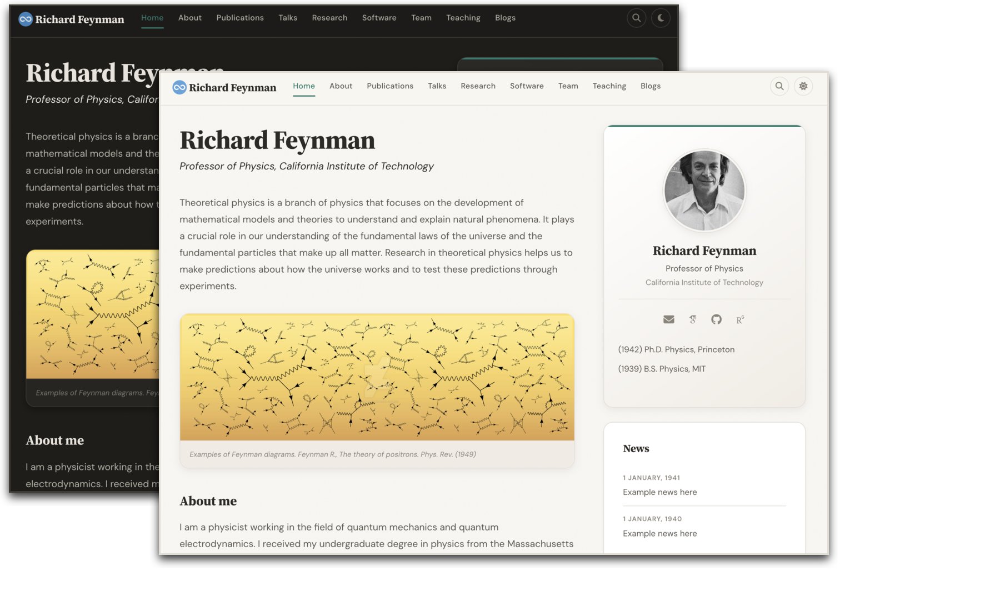
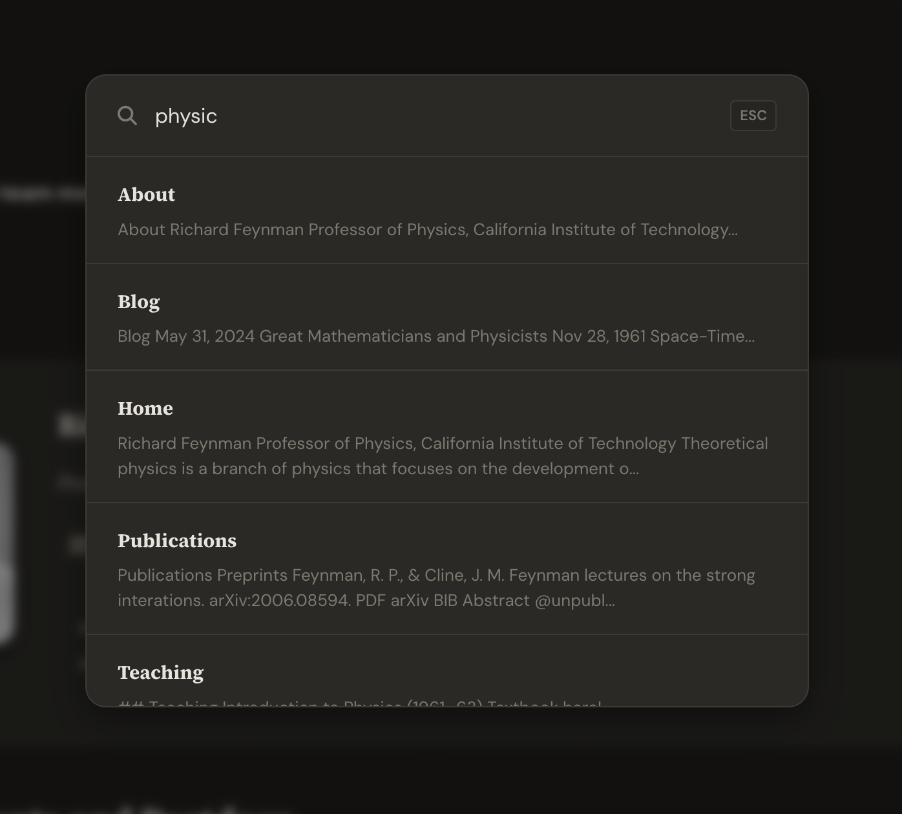

# A website template for academics

<p align="center">
  
</p>

<p align="center">
  <strong>A beautiful, production-ready Jekyll website for academics and research groups.</strong><br>
  Fork it. Fill in your info. Publish.
</p>

<h3 align="center">
  <a href="https://sbryngelson.github.io/academic-website-template/">See the live demo &rarr;</a>
</h3>

<p align="center">
  <a href="#quick-start">Quick Start</a> &middot;
  <a href="#features">Features</a> &middot;
  <a href="#customization">Customization</a> &middot;
  <a href="#publications">Publications</a> &middot;
  <a href="#hosting">Hosting</a>
</p>

### Used by 200+ academics worldwide

<a href="https://ilafly.github.io/" target="_blank">★</a>
<a href="https://i-vesseg.github.io/" target="_blank">★</a>
<a href="https://xfangsn.github.io/" target="_blank">★</a>
<a href="https://joshuagob.github.io" target="_blank">★</a>
<a href="https://bczheng.com/" target="_blank">★</a>
<a href="https://bazilinskyy.github.io/" target="_blank">★</a>
<a href="https://www.coreytcallaghan.com/" target="_blank">★</a>
<a href="https://minseoksong.github.io/" target="_blank">★</a>
<a href="https://acme-group-cmu.github.io/" target="_blank">★</a>
<a href="https://barrylee36.github.io/" target="_blank">★</a>
<a href="https://adisun94.github.io/" target="_blank">★</a>
<a href="https://comp-physics.group" target="_blank">★</a>
<a href="https://spike.doc.ic.ac.uk/" target="_blank">★</a>
<a href="http://www.msc.univ-paris-diderot.fr/~berhanu/" target="_blank">★</a>
<a href="https://mashadab.github.io/" target="_blank">★</a>
<a href="https://home.iitk.ac.in/~lalit/" target="_blank">★</a>
<a href="https://ethan-pickering.github.io/" target="_blank">★</a>
<a href="https://pedro-dm-gomes.github.io/" target="_blank">★</a>
<a href="https://3tbk.github.io/3tbk/" target="_blank">★</a>
<a href="https://felipesua.github.io/" target="_blank">★</a>
<a href="https://shivvrat.github.io/" target="_blank">★</a>
<a href="https://ritamraha.github.io/" target="_blank">★</a>
<a href="https://matsesseldeurs.github.io/" target="_blank">★</a>
<a href="https://michelleblom.github.io/" target="_blank">★</a>
<a href="https://jrd971000.github.io/" target="_blank">★</a>
<a href="https://melashri.net/" target="_blank">★</a>
<a href="https://sahatulika15.github.io" target="_blank">★</a>
<a href="https://mzhanglab.github.io" target="_blank">★</a>
<a href="https://soar-lab.github.io" target="_blank">★</a>
<a href="https://azharghafoor.github.io/" target="_blank">★</a>
<a href="https://hyunwoo.info/" target="_blank">★</a>
<a href="https://computervision0.github.io/" target="_blank">★</a>
<a href="https://adrashid.github.io/personal-webpage/index.html" target="_blank">★</a>
<a href="https://aleemkhan62.github.io/" target="_blank">★</a>
<a href="https://vaibhavb007.github.io/" target="_blank">★</a>
<a href="https://gabry993.github.io/" target="_blank">★</a>
<a href="https://shantnuu.github.io/" target="_blank">★</a>
<a href="https://wenbinluomath.github.io/" target="_blank">★</a>
<a href="https://aibio-lab.github.io/" target="_blank">★</a>
<a href="https://dartsushi.github.io/" target="_blank">★</a>
<a href="https://efstathia-soufleri.github.io/" target="_blank">★</a>
<a href="https://zchoffin.github.io/" target="_blank">★</a>
<a href="https://wangyb97.github.io/" target="_blank">★</a>
<a href="https://sgleem.github.io/" target="_blank">★</a>
<a href="https://has97.github.io/" target="_blank">★</a>
<a href="https://albertgassol1.github.io/" target="_blank">★</a>
<a href="https://seanpark05.github.io/" target="_blank">★</a>
<a href="https://miki998.github.io/" target="_blank">★</a>
<a href="https://wilfonba.github.io/" target="_blank">★</a>
<a href="https://saharnazb.github.io/" target="_blank">★</a>
<a href="https://mvmacfarlane.github.io/" target="_blank">★</a>
<a href="https://saharnaz.org/" target="_blank">★</a>
<a href="https://www.isnicholas.com/" target="_blank">★</a>
<a href="https://jojox666.github.io/" target="_blank">★</a>
<a href="https://zhiyu7.github.io/" target="_blank">★</a>
<a href="https://awen-li.github.io/" target="_blank">★</a>
<a href="https://yukiiwong.github.io/" target="_blank">★</a>
<a href="https://joeyleehk.github.io/" target="_blank">★</a>
<a href="https://fabayocbocjr.github.io/" target="_blank">★</a>
<a href="https://www.quantumcookie.xyz/" target="_blank">★</a>
<a href="https://adityanandy.github.io/" target="_blank">★</a>
<a href="https://jlastro.github.io/" target="_blank">★</a>
<a href="https://yunzhe-li.top/" target="_blank">★</a>
<a href="https://xia-hu.github.io/" target="_blank">★</a>
<a href="https://p-bajpai.github.io/" target="_blank">★</a>
<a href="https://aashen12.github.io/" target="_blank">★</a>
<a href="https://Abdurrahheem.github.io/" target="_blank">★</a>
<a href="https://abhimanyu911.github.io/" target="_blank">★</a>
<a href="https://abhishek-sehgal.github.io/" target="_blank">★</a>
<a href="https://adityaIyerramesh98.github.io/" target="_blank">★</a>
<a href="https://AdityaSinghDevs.github.io/" target="_blank">★</a>
<a href="https://aipsita.github.io/" target="_blank">★</a>
<a href="https://albertopadovan.github.io/" target="_blank">★</a>
<a href="https://alirezanorouziazad.github.io/" target="_blank">★</a>
<a href="https://amy-tabb.github.io/" target="_blank">★</a>
<a href="https://anedelin.github.io/" target="_blank">★</a>
<a href="https://ansharora7.github.io/" target="_blank">★</a>
<a href="https://avadapal.github.io/" target="_blank">★</a>
<a href="https://avibagchi.github.io/" target="_blank">★</a>
<a href="https://bc1032.github.io/" target="_blank">★</a>
<a href="https://BDalheimer.github.io/" target="_blank">★</a>
<a href="https://Bennibraun.github.io/" target="_blank">★</a>
<a href="https://binbin-xie.github.io/" target="_blank">★</a>
<a href="https://BiomedLabUGgt.github.io/" target="_blank">★</a>
<a href="https://c752334430.github.io/" target="_blank">★</a>
<a href="https://Chemical118.github.io/" target="_blank">★</a>
<a href="https://chihaoy.github.io/" target="_blank">★</a>
<a href="https://cjaynjoku.github.io/" target="_blank">★</a>
<a href="https://DennisWayo.github.io/" target="_blank">★</a>
<a href="https://dginsberg.github.io/" target="_blank">★</a>
<a href="https://dgiovanis.github.io/" target="_blank">★</a>
<a href="https://donghuison.github.io/" target="_blank">★</a>
<a href="https://donghuixin.github.io/" target="_blank">★</a>
<a href="https://drgHannah.github.io/" target="_blank">★</a>
<a href="https://DrWeiChen.github.io/" target="_blank">★</a>
<a href="https://econpotter.github.io/" target="_blank">★</a>
<a href="https://elitalobo.github.io/" target="_blank">★</a>
<a href="https://emilyvansyoc.github.io/" target="_blank">★</a>
<a href="https://Erd-ling.github.io/" target="_blank">★</a>
<a href="https://estimation-control-learning-laboratory.github.io/" target="_blank">★</a>
<a href="https://EthanJ666.github.io/" target="_blank">★</a>
<a href="https://f-farhan.github.io/" target="_blank">★</a>
<a href="https://fekaputra.github.io/" target="_blank">★</a>
<a href="https://FishyguyNeel.github.io/" target="_blank">★</a>
<a href="https://flampouris.github.io/" target="_blank">★</a>
<a href="https://flavio2018.github.io/" target="_blank">★</a>
<a href="https://Frellaa.github.io/" target="_blank">★</a>
<a href="https://gabrielpachecoribeiro.github.io/" target="_blank">★</a>
<a href="https://gcg-helsinki.github.io/" target="_blank">★</a>
<a href="https://giorgioarcara.github.io/" target="_blank">★</a>
<a href="https://gmtang1212.github.io/" target="_blank">★</a>
<a href="https://gmurtaza404.github.io/" target="_blank">★</a>
<a href="https://Grupo-MATE.github.io/" target="_blank">★</a>
<a href="https://guancai.github.io/" target="_blank">★</a>
<a href="https://guharoysayak.github.io/" target="_blank">★</a>
<a href="https://haochey.github.io/" target="_blank">★</a>
<a href="https://HC-teemo.github.io/" target="_blank">★</a>
<a href="https://heymarco.github.io/" target="_blank">★</a>
<a href="https://hkkaushik.github.io/" target="_blank">★</a>
<a href="https://HORIZON-COVER.github.io/" target="_blank">★</a>
<a href="https://hrositi.github.io/" target="_blank">★</a>
<a href="https://hsparkastro.github.io/" target="_blank">★</a>
<a href="https://hyojoonkim.github.io/" target="_blank">★</a>
<a href="https://JamesL404.github.io/" target="_blank">★</a>
<a href="https://jasonarothman.github.io/" target="_blank">★</a>
<a href="https://Jeffery-Zhou.github.io/" target="_blank">★</a>
<a href="https://jianxyou.github.io/" target="_blank">★</a>
<a href="https://Jiawei-sn.github.io/" target="_blank">★</a>
<a href="https://jortizcs.github.io/" target="_blank">★</a>
<a href="https://jtonos.github.io/" target="_blank">★</a>
<a href="https://JudithBouman2412.github.io/" target="_blank">★</a>
<a href="https://jujubonda.github.io/" target="_blank">★</a>
<a href="https://jumeike.github.io/" target="_blank">★</a>
<a href="https://Kadle11.github.io/" target="_blank">★</a>
<a href="https://KaihangShi.github.io/" target="_blank">★</a>
<a href="https://KALU-KELECHI-GABRIEL.github.io/" target="_blank">★</a>
<a href="https://Khris-VI.github.io/" target="_blank">★</a>
<a href="https://KieuTruong.github.io/" target="_blank">★</a>
<a href="https://Koromonnnnnnnn.github.io/" target="_blank">★</a>
<a href="https://ktvank.github.io/" target="_blank">★</a>
<a href="https://Kunlun-Zhu.github.io/" target="_blank">★</a>
<a href="https://kwakkyoleen.github.io/" target="_blank">★</a>
<a href="https://leowangx2013.github.io/" target="_blank">★</a>
<a href="https://lokingdav.github.io/" target="_blank">★</a>
<a href="https://ltinphan.github.io/" target="_blank">★</a>
<a href="https://lzy37ld.github.io/" target="_blank">★</a>
<a href="https://manshri.github.io/" target="_blank">★</a>
<a href="https://martinezach.github.io/" target="_blank">★</a>
<a href="https://minhphd.github.io/" target="_blank">★</a>
<a href="https://mohamed-s-ibrahim.github.io/" target="_blank">★</a>
<a href="https://mohammedaflah.github.io/" target="_blank">★</a>
<a href="https://monroyaume5.github.io/" target="_blank">★</a>
<a href="https://mrajiullah.github.io/" target="_blank">★</a>
<a href="https://msstate-athena.github.io/" target="_blank">★</a>
<a href="https://mvanwyngarden.github.io/" target="_blank">★</a>
<a href="https://Naeele.github.io/" target="_blank">★</a>
<a href="https://Nebularaid2000.github.io/" target="_blank">★</a>
<a href="https://neuronpain.github.io/" target="_blank">★</a>
<a href="https://NickJi98.github.io/" target="_blank">★</a>
<a href="https://noahzegna.github.io/" target="_blank">★</a>
<a href="https://overlorde.github.io/" target="_blank">★</a>
<a href="https://p4rkerw.github.io/" target="_blank">★</a>
<a href="https://Penghuihuang2000.github.io/" target="_blank">★</a>
<a href="https://Pragati-Meshram.github.io/" target="_blank">★</a>
<a href="https://qianhuimen.github.io/" target="_blank">★</a>
<a href="https://qzkiyoshi.github.io/" target="_blank">★</a>
<a href="https://ricethchang.github.io/" target="_blank">★</a>
<a href="https://robenlunardi.github.io/" target="_blank">★</a>
<a href="https://royess.github.io/" target="_blank">★</a>
<a href="https://rupendra248.github.io/" target="_blank">★</a>
<a href="https://SantiagoxSosa.github.io/" target="_blank">★</a>
<a href="https://saorisakaue.github.io/" target="_blank">★</a>
<a href="https://SelzerConst.github.io/" target="_blank">★</a>
<a href="https://sherdencooper.github.io/" target="_blank">★</a>
<a href="https://shsjxzh.github.io/" target="_blank">★</a>
<a href="https://Smadx.github.io/" target="_blank">★</a>
<a href="https://sophie-carneiro.github.io/" target="_blank">★</a>
<a href="https://ssun32.github.io/" target="_blank">★</a>
<a href="https://st-eislab.github.io/" target="_blank">★</a>
<a href="https://suprovo97.github.io/" target="_blank">★</a>
<a href="https://takouajendoubi.github.io/" target="_blank">★</a>
<a href="https://ThomasMartinez0.github.io/" target="_blank">★</a>
<a href="https://thu-gyt.github.io/" target="_blank">★</a>
<a href="https://tokeron.github.io/" target="_blank">★</a>
<a href="https://ttadano.github.io/" target="_blank">★</a>
<a href="https://valentinsix.github.io/" target="_blank">★</a>
<a href="https://victorolaiya.github.io/" target="_blank">★</a>
<a href="https://vmetsis.github.io/" target="_blank">★</a>
<a href="https://wanganzhi.github.io/" target="_blank">★</a>
<a href="https://wjin4.github.io/" target="_blank">★</a>
<a href="https://wufan-here.github.io/" target="_blank">★</a>
<a href="https://wumirose.github.io/" target="_blank">★</a>
<a href="https://xianzhangchen.github.io/" target="_blank">★</a>
<a href="https://xietian1.github.io/" target="_blank">★</a>
<a href="https://Xueyi-Wang.github.io/" target="_blank">★</a>
<a href="https://xyhanO.github.io/" target="_blank">★</a>
<a href="https://yasserfarouk.github.io/" target="_blank">★</a>
<a href="https://yewenC.github.io/" target="_blank">★</a>
<a href="https://yilevine.github.io/" target="_blank">★</a>
<a href="https://ykl7.github.io/" target="_blank">★</a>
<a href="https://yminzhang.github.io/" target="_blank">★</a>
<a href="https://yuminglab.github.io/" target="_blank">★</a>
<a href="https://zeyuD.github.io/" target="_blank">★</a>
<a href="https://zhoulongyu.github.io/" target="_blank">★</a>

__Using this template? Share your site and I'll add it here!__

---

## Features

### Design
- **Source Serif 4 + DM Sans** typography — elegant serif headings paired with a clean geometric sans body
- **Warm parchment palette** with subtle noise texture for depth, not flat generic whites
- **Dark mode** — toggle in navbar, auto-detects system preference, persists across visits
- **Frosted glass navbar** with backdrop blur, active page indicator, and scroll shadow
- **Dynamic SVG favicon** — auto-generated from your initials + accent color
- **Responsive** — CSS Grid layouts that adapt from desktop to tablet to mobile

### Interactions
- **Site-wide search** — press `Cmd+K` (or `Ctrl+K`) to instantly search all pages
- **Copy BibTeX** — hover any bibtex block to reveal a one-click copy button
- **Animated link underlines** — smooth gradient underlines that grow on hover
- **Card hover effects** — lift + shadow on team cards, research cards, and profile photo
- **Image zoom** — subtle scale on hover for team photos, research thumbnails, and the banner
- **Back-to-top button** — appears on scroll, smooth scrolls up
- **Smooth expand/collapse** — CSS transitions on publication abstracts and BibTeX entries

### Publications
- **Auto-generated from BibTeX** via Jekyll Scholar — just edit `assets/ref.bib`
- **Search bar** — filter publications by title, author, or year
- **Year badges** — small accent-colored pills for quick scanning
- **Pill buttons** — PDF, DOI, arXiv, BIB, Abstract

### For New Users
- **Interactive setup script** — run `./setup.sh` to fill in your name, title, and institution
- **4-step `_config.yml`** — numbered sections with inline comments guide you through setup
- **Well-commented data files** — every field in `_data/*.yml` is explained with examples
- **Smart link handling** — empty links in config are automatically hidden (no broken icons)

### Technical
- **Modular SASS** — organized into `base/`, `components/`, `layouts/`, `utilities/`
- **Selective Bootstrap 5.3.3** — only imports the modules used, not the full bundle
- **Single JS file** (4KB minified) — dark mode, search, toggles, scroll effects, copy button
- **Auto-generated sitemap** via `jekyll-sitemap`
- **Open Graph + Twitter Cards** — links look good when shared on social media
- **MathJax 3** — LaTeX formula rendering out of the box

## Screenshots

| | |
|:---:|:---:|
|  |  |
| Publications with search & year badges | Team page with card grid |
|  | |
| Site-wide search (Cmd+K) | |

## Quick Start

1. **Fork** [this repository](https://github.com/sbryngelson/academic-website-template)
2. **Delete** `_config_demo.yml` (it's only for the demo site)
3. **Install** [Jekyll](https://jekyllrb.com/docs/installation/) and run `bundle install`
3. **Configure** your site:
   ```bash
   ./setup.sh          # interactive setup, or
   vim _config.yml     # edit Steps 1-4 directly
   ```
4. **Add your publications** to `assets/ref.bib`
5. **Customize** data files in `_data/` (team members, news, awards, etc.)
6. **Preview** your site:
   ```bash
   bundle exec jekyll serve
   # open http://localhost:4000
   ```

## Detailed How-To Guide

### Step 1: Fork and Clone

```bash
# Fork the repo on GitHub, then clone your fork
git clone https://github.com/YOUR_USERNAME/YOUR_USERNAME.github.io.git
cd YOUR_USERNAME.github.io
```

### Step 2: Install Dependencies

You need Ruby and Jekyll installed. See [Jekyll's installation guide](https://jekyllrb.com/docs/installation/).

```bash
# Install Ruby gems
bundle install

# Optional: install Node.js dependencies (only needed if you want to edit JS)
npm install
```

### Step 3: Configure Your Identity

Open `_config.yml` and fill in your information. The file is organized into numbered steps:

```yaml
# STEP 1: Your Identity
name: "Jane Smith"
title: "Assistant Professor of Computer Science"
institution: "Stanford University"
email: jsmith@stanford.edu
photo: headshot.jpg   # place your photo in images/
```

Or run the interactive setup script:

```bash
./setup.sh
```

### Step 4: Add Your Links

Still in `_config.yml`, add your academic profiles. Delete any you don't use:

```yaml
# STEP 2: Your Links
links:
  google_scholar: "https://scholar.google.com/citations?user=YOUR_ID"
  github: "https://github.com/yourusername"
  orcid: "https://orcid.org/0000-0000-0000-0000"
  cv: "papers/cv.pdf"        # place your CV in the papers/ directory
  twitter: ""                # leave blank to hide
  linkedin: ""
```

### Step 5: Add Your Photo

Place your profile photo in the `images/` directory. Update the `photo` field in `_config.yml` to match the filename.

### Step 6: Add Publications

Edit `assets/ref.bib` with your BibTeX entries. The publications page is auto-generated. Example:

```bibtex
@article{smith2024,
  author = {Smith, Jane and Doe, John},
  title = {A Novel Approach to Machine Learning},
  journal = {Nature},
  year = {2024},
  volume = {42},
  pages = {1--10},
  doi = {10.1234/example},
  file = {smith2024.pdf},       % place PDF in papers/
  abstract = {We present...}
}
```

To bold your name in the publication list, update the scholar settings in `_config.yml`:

```yaml
scholar:
  last_name: Smith
  first_name: [Jane, J.]
```

Then uncomment the name-bolding line in `_layouts/bibtemplate.html`.

### Step 7: Add Team Members

Edit `_data/team_members.yml`:

```yaml
- name: Alice Johnson
  photo: alice.jpg          # place in images/ or images/team/
  info: PhD Student, started Fall 2023
  email: alice@university.edu
  website: https://alice.dev
  github: https://github.com/alice
```

### Step 8: Add News

Edit `_data/news.yml` (newest first):

```yaml
- date: 15 March, 2024
  headline: "Our paper on X was accepted to NeurIPS!"

- date: 1 January, 2024
  headline: "Welcome to new PhD student Alice Johnson"
```

### Step 9: Customize Pages

Each page in `_pages/` is a Markdown file. Edit the content directly:

- `home.md` — your welcome text and bio
- `research.md` — describe your research areas
- `software.md` — list your software projects
- `teaching.md` — list your courses

To remove a page from the navbar, comment it out in `_config.yml`:

```yaml
nav_pages:
  - name: about
  - name: publications
  # - name: talks        # hidden from navbar
  - name: research
```

### Step 10: Preview and Deploy

```bash
# Preview locally
bundle exec jekyll serve
# Visit http://localhost:4000

# When ready, push to GitHub
git add -A
git commit -m "My academic website"
git push
```

A GitHub Actions workflow automatically builds and deploys your site on every push. Make sure to go to **Settings > Pages > Source** in your repo and select **GitHub Actions**.

Your site will be live at `https://YOUR_USERNAME.github.io` within a few minutes.

---

## Customization

### _config.yml

The config file is organized into 4 numbered steps:

| Step | Section | What to fill in |
|------|---------|-----------------|
| 1 | **Your Identity** | Name, title, institution, email, photo |
| 2 | **Your Links** | Google Scholar, GitHub, ORCID, Twitter, LinkedIn, CV |
| 3 | **Site Settings** | Accent color, dark mode toggle, analytics |
| 4 | **Your Pages** | Comment out any pages you don't need |

### Data Files

| File | Purpose |
|------|---------|
| `_data/team_members.yml` | Current students and postdocs |
| `_data/alumni.yml` | Former lab members |
| `_data/news.yml` | News items (3 most recent shown on home) |
| `_data/awards.yml` | Awards and honors |
| `_data/grants.yml` | Grants and funding |
| `_data/funders.yml` | Funder logos |
| `_data/people.yml` | Students and mentees |
| `_data/pi.yml` | Optional: detailed education for About page |

Each file has inline comments explaining every field. Entries marked `# EXAMPLE` should be replaced or deleted.

### Pages

All pages are in `_pages/`. Edit the Markdown content directly. Pages use the `gridlay` layout by default.

### Accent Color & Dark Mode

Set `accent_color` in `_config.yml` to change the theme color across the entire site (links, buttons, highlights, favicon). Set `dark_mode: false` to disable the dark mode toggle entirely.

### CSS & JS Customization

The site uses modular SASS in `_sass/`:

```
_sass/
  base/          # variables, typography, reset
  components/    # card, navbar, buttons, footer, profile, publication, search
  layouts/       # home grid, team grid, research grid
  utilities/     # dark mode, animations
```

For JavaScript, edit `assets/js/site.js` then run `npm run build` to minify. Pre-built JS is committed, so `npm` is only needed if you modify the source.

## Publications

Publications are managed via [Jekyll Scholar](https://github.com/inukshuk/jekyll-scholar) using BibTeX. Edit `assets/ref.bib` with your references.

Update `scholar.last_name` and `scholar.first_name` in `_config.yml` to auto-bold your name in the publication list.

## Hosting

### GitHub Pages

Fork this repo as `your_username.github.io` and push. A **GitHub Actions workflow** is included (`.github/workflows/deploy.yml`) that automatically builds the site with Jekyll Scholar and deploys to GitHub Pages on every push to `source`.

To enable it: go to your repo's **Settings > Pages > Source** and select **GitHub Actions** instead of "Deploy from a branch".

### Custom Domain

Purchase a domain, update the `CNAME` file, and configure DNS. See [GitHub's guide](https://docs.github.com/en/pages/configuring-a-custom-domain-for-your-github-pages-site).

### Self-Hosting

Build with `bundle exec jekyll serve`, then upload `_site/` to your server. Set `url` and `baseurl` in `_config.yml` accordingly.

## Upgrading

Coming from the previous version? See [UPGRADING.md](UPGRADING.md).

## Alternatives

* [al-folio](https://github.com/alshedivat/al-folio)
* [academicpages](https://academicpages.github.io/)
* [Minimal Mistakes](https://mmistakes.github.io/minimal-mistakes/)

## Acknowledgment

I credit the [Allen Lab](https://www.allanlab.org/) for creating a beautiful academic research group webpage. Many parts of this site were adopted or copied from their laboratory webpage.

## License

MIT
